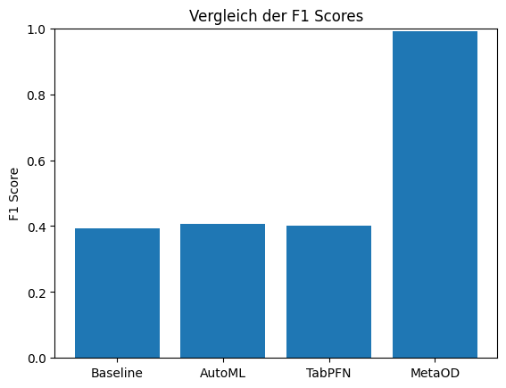

# Unsupervised AutoML for Anomaly Detection

Dieses Repository untersucht verschiedene Ansätze für **unsupervised AutoML** in der Anomalieerkennung.  
Ziel ist es, unterschiedliche Verfahren zu vergleichen und ihre Eignung für industrielle Prozesse zu evaluieren.

---

## Überblick

Es werden verschiedene Strategien betrachtet:

1. Klassische Baseline
2. Semi-Supervised AutoML Pipeline
3. Transformer-Modell (TapPFN)
4. Meta-Learning (MetaOD)

---

## Vorgehen

### 1. Baseline
Als Referenz wurde ein einfacher **Isolation Forest** verwendet.

---

### 2. Eigene AutoML Pipeline (Semi-Supervised)

Hier wurden vier Modelle mit **Optuna Hyperparameter-Optimierung** verglichen:

- Z-Score
- One-Class SVM (OCSVM)
- Isolation Forest (iForest)
- Self-Organizing Map (SOM) – eigene Implementierung

Das beste Modell wird automatisch anhand des **F1-Scores** ausgewählt.  
> Der F1-Score ist sinnvoll, da er **Precision und Recall kombiniert** und damit das Gleichgewicht zwischen korrekten und verpassten Anomalien misst.

---

### 3. Transformer-Ansatz

Vergleich mit einem Foundation-Model für tabellarische Daten:

**TapPFN**

- Nutzung lokal über GPU
- Nur Setup-Datei im Repository enthalten, der Code läuft über HuggingFace

---

### 4. Meta-Learning

Abschließend wurde **Meta-Learning** mit **MetaOD** eingesetzt:  

- Vorhersage des am besten geeigneten Anomalie-Modells basierend auf den Meta-Features des Datensatzes
- Eigenes Setup und separate Umgebung erforderlich  
- Weitere Informationen befinden sich in der **MetaOD-Readme** im entsprechenden Ordner

---

## Datensätze

- Alle Datensätze liegen im Ordner `data/`
- Enthalten Werte vom **3-Tank-Prozess**
- Jeder Datensatz enthält mehrere **Steps**
- Für den finalen Vergleich wurde **Step 8** verwendet

---

## Evaluationsmetriken

- **F1-Score** dient als primäre Bewertungsmetrik
- Kombination von **Precision** und **Recall** macht ihn ideal für Anomalieerkennung, bei der sowohl Fehlalarme als auch verpasste Anomalien relevant sind 

---

## Ergebnis



---

## Setup

### Standard-Pipeline (Baseline + AutoML)

**Empfohlene Python-Version:**  
- Python 3.10 oder 3.11  

### Installation

Virtuelle Umgebung erstellen und aktivieren:

```bash
python -m venv venv
source venv/bin/activate      # Windows: venv\Scripts\activate
pip install -r requirements.txt
```

### Nutzung des Datensatzes

Für die Verwendung des Datensatzes ist **Git LFS** erforderlich.

Bitte einmalig folgende Befehle ausführen:

```bash
git lfs install
git lfs pull
```

Dadurch wird das vollständige Dataset heruntergeladen.
Ohne diesen Schritt kann der Datensatz im Code nicht korrekt geladen werden, da große Dateien über Git LFS verwaltet werden.

---

### Meta-Learning Setup (MetaOD)

- Eigenes Setup im Ordner `meta_learning/`  
- Separate Python-Umgebung notwendig  
- Weitere Anweisungen siehe dortige README


---

### TabPFN Setup

- Eigenes Setup im Ordner `TabPFN/`  
- HuggingFace-Account notwendig
- Weitere Anweisungen siehe dortige README

---

## Projektstruktur

```
├── automl_pipeline/
├── meta_learning/
├── transformer_setup/
├── data/
├── requirements.txt
└── README.md
```

---

## Hinweise

- TapPFN benötigt GPU für die lokale Ausführung
- Ergebnisse können je nach CPU / BLAS / GPU Backend leicht variieren
- Für reproduzierbare Experimente:

"pip freeze > requirements_lock.txt"

---

## Ziel des Projekts

Projektarbeit mit Ziel, **verschiedene Vorgehensweisen in unsupervised AutoML für Anomalieerkennung zu vergleichen**.  
